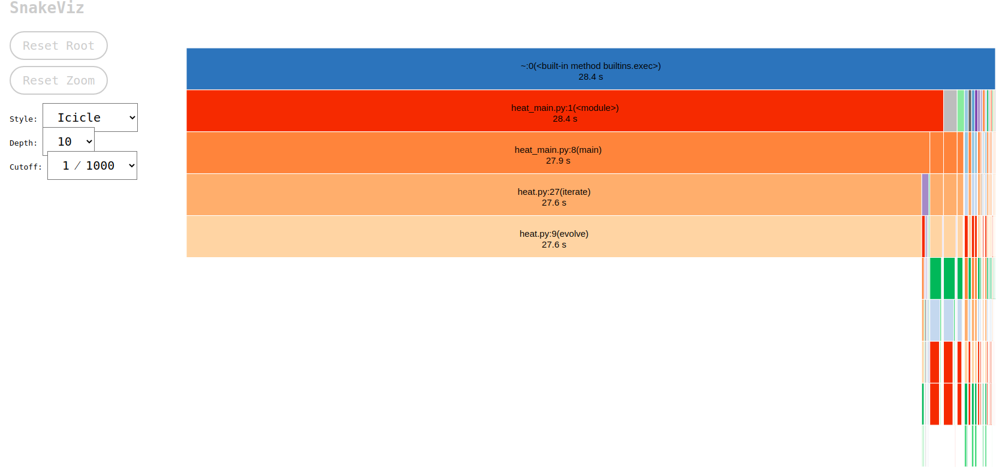
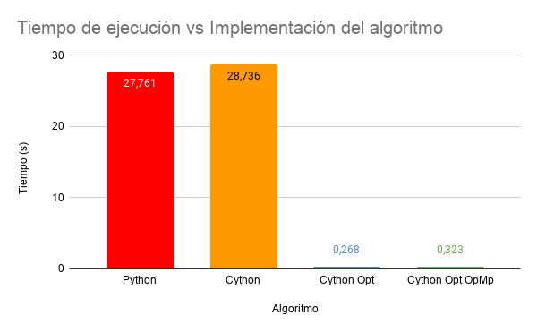
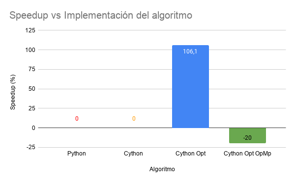

## Ejercicio de transferencia de calor en Cython
La ecuación del calor o _heat equation_ corresponde a una ecuación diferencial que indica la distribución de la temperatura dentro de un objeto. Su solución se puede obtener por medios iterativos lo que lo hace un ejercicio óptimo para la experimentación y optimización del algoritmo [[1]](https://tutorial.math.lamar.edu/classes/de/theheatequation.aspx). En el presente repositorio se recopilan una serie de optimizaciones a la función `heat.py` con el propósito de comparar estas medidas.

Cada una de las optimizaciones se encuentran en una carpeta distinta.

### Perfilamiento del algoritmo implementado en Python
Usamos `cProfile` para obtener el perfil de ejecución del algoritmo sin ninguna optimización del código.
```bash
python3 -m cProfile -o profiler_py.dat heat_main.py
```
Posteriormente se usó `pstats` para leer el archivo `profiler_py.dat` generado.
```bash
python3 -m pstats profiler_py.dat 
```
El resultado ordenado por tiempo (`sort time`) y limitado a las 10 primeras funciones (`stats 10`) corresponde a:

```
Sun Nov 22 21:42:14 2020    profiler_py.dat

         720111 function calls (709981 primitive calls) in 28.420 seconds

   Ordered by: internal time
   List reduced from 3482 to 10 due to restriction <10>

   ncalls  tottime  percall  cumtime  percall filename:lineno(function)
      200   27.597    0.138   27.597    0.138 /home/epic-man/Documents/PPF/Parcial/heat.py:9(evolve)
      264    0.048    0.000    0.048    0.000 {built-in method marshal.loads}
        2    0.040    0.020    0.040    0.020 {method 'encode' of 'ImagingEncoder' objects}
        8    0.034    0.004    0.035    0.004 {built-in method matplotlib._image.resample}
     2667    0.032    0.000    0.052    0.000 /usr/lib/python3.8/inspect.py:625(cleandoc)
      317    0.025    0.000    0.025    0.000 {built-in method builtins.compile}
 1081/969    0.019    0.000    0.085    0.000 {built-in method builtins.__build_class__}
     2428    0.019    0.000    0.021    0.000 /usr/lib/python3.8/enum.py:283(__call__)
    40000    0.018    0.000    0.022    0.000 /home/epic-man/.local/lib/python3.8/site-packages/numpy/lib/npyio.py:759(floatconv)
     1074    0.016    0.000    0.023    0.000 /usr/lib/python3.8/inspect.py:2889(_bind)

```
Donde se aprecia que la función `evolve` dentro del archivo heat.py consume la mayor cantidad de tiempo con un total de 27.597 segundos. Se hizo uso también de la herramienta `snakeviz` para monstrar gráficamente los resultados anteriores.



Las funciones antes de `heat.py:evolve` solo corresponde al stack trace del programa (funciones que se llaman en orden, una dentro de otra) y su valor en tiempo es el total acumulado.


### Perfilamiento del algoritmo implementado en Cython
Se realizó un archivo `.pyx` con una implementación simple en Cython del archivo `heat.py` para comprobar la mejora en rendimiento respecto al anterior. **El algoritmo no sufrió ninguna modificación, simplemente se convirtió a C con Cython**.

Para generar el archivo `.c` dado un archivo `.pyx`, se creó un archivo denominado `setup.py`, en el que se indica el archivo a "cythonizar".

Posteriormente se ejecutó con el comando:
```bash
python3 setup.py build_ext --inplace
```
El resultado fueron una carpeta `build`, el archivo traducido a C, `heat.pyx` y un archivo `.so`. De manera similar a la implementación en Python, se creó un perfil de la ejecución usando ahora el archivo `heat.c`. Los resultados fueron los siguientes:

```
Sun Nov 22 22:55:31 2020    profiler_cy_1.dat

         719841 function calls (709669 primitive calls) in 25.542 seconds

   Ordered by: internal time
   List reduced from 3480 to 10 due to restriction <10>

   ncalls  tottime  percall  cumtime  percall filename:lineno(function)
        1   24.701   24.701   24.701   24.701 {heat.iterate}
      263    0.049    0.000    0.049    0.000 {built-in method marshal.loads}
        8    0.041    0.005    0.042    0.005 {built-in method matplotlib._image.resample}
        2    0.039    0.020    0.039    0.020 {method 'encode' of 'ImagingEncoder' objects}
     2667    0.031    0.000    0.052    0.000 /usr/lib/python3.8/inspect.py:625(cleandoc)
      317    0.024    0.000    0.024    0.000 {built-in method builtins.compile}
 1081/969    0.020    0.000    0.084    0.000 {built-in method builtins.__build_class__}
     2428    0.019    0.000    0.021    0.000 /usr/lib/python3.8/enum.py:283(__call__)
    40000    0.018    0.000    0.022    0.000 /home/epic-man/.local/lib/python3.8/site-packages/numpy/lib/npyio.py:759(floatconv)
       29    0.016    0.001    0.019    0.001 {built-in method _imp.create_dynamic}

```
El resultado ahora demuestra que el método `iterate` es el que consume más tiempo en ejecución. En total se tomó 25.542 segundos en la ejecución del algoritmo.

### Perfilamiento de la implementación del algoritmo en Cython
Se quizo comprobar ahora la mejora de rendimiento usando diferentes funciones de alto nivel y definiciones de variables propias de Cython (que posteriormente se convierten a C). Una vez creado el archivo `heat.pyx` con estos cambios, se procedió a ejecutar el `setup.py` junto el perfilador `cProfile`. 

Los resultados se encuentran a continuación.

```
Sun Nov 22 23:19:45 2020    profiler_cy_2.dat

         719843 function calls (709671 primitive calls) in 0.888 seconds

   Ordered by: internal time
   List reduced from 3480 to 10 due to restriction <10>

   ncalls  tottime  percall  cumtime  percall filename:lineno(function)
        2    0.049    0.024    0.049    0.024 {method 'encode' of 'ImagingEncoder' objects}
      263    0.048    0.000    0.048    0.000 {built-in method marshal.loads}
        8    0.042    0.005    0.042    0.005 {built-in method matplotlib._image.resample}
        1    0.033    0.033    0.033    0.033 {heat.iterate}
     2667    0.031    0.000    0.052    0.000 /usr/lib/python3.8/inspect.py:625(cleandoc)
      317    0.025    0.000    0.025    0.000 {built-in method builtins.compile}
 1081/969    0.019    0.000    0.084    0.000 {built-in method builtins.__build_class__}
     2428    0.019    0.000    0.021    0.000 /usr/lib/python3.8/enum.py:283(__call__)
    40000    0.019    0.000    0.022    0.000 /home/epic-man/.local/lib/python3.8/site-packages/numpy/lib/npyio.py:759(floatconv)
     1074    0.018    0.000    0.026    0.000 /usr/lib/python3.8/inspect.py:2889(_bind)
```

Como se aprecia, hubo una disminución considerable del tiempo de ejecución usando las directivas de división, definción de variables y una optimización del código cambiando una división por una multiplicación.

### Perfilamiento de la optimización en Cython y OpenMP
Finalmente se realizó una comparación con una implementación del algoritmo usando el API `prange` dentro de `cython.parallel` al momento de realizar el ciclo que calcula la siguiente aproximación en el método `evolve` junto con las anteriores optimizaciones. El archivo `setup.py` tuvo que ser modificado para indicar ahora el flag `-fopenmp` [[2]](https://cython.readthedocs.io/en/latest/src/userguide/parallelism.html) :

```python
from setuptools import Extension, setup
from Cython.Build import cythonize
import numpy

ext_modules = [
    Extension(
        "heat_cy_openmp",
        ["heat_cy_openmp.pyx"],
        extra_compile_args=['-fopenmp'],
        extra_link_args=['-fopenmp'],
    )
]

setup(
    name='heat_cy_openmp',
    ext_modules=cythonize(ext_modules),
    include_dirs=[numpy.get_include()]
)
```

Los resultados con `cProfile` y `pstats` se presentan a continuación:

```
Tue Nov 24 02:43:44 2020    profiler_cy_openmp.dat

         719841 function calls (709669 primitive calls) in 0.947 seconds

   Ordered by: internal time
   List reduced from 3480 to 10 due to restriction <10>

   ncalls  tottime  percall  cumtime  percall filename:lineno(function)
        1    0.056    0.056    0.056    0.056 {heat_cy_openmp.iterate}
        2    0.050    0.025    0.050    0.025 {method 'encode' of 'ImagingEncoder' objects}
      263    0.049    0.000    0.049    0.000 {built-in method marshal.loads}
        8    0.043    0.005    0.044    0.005 {built-in method matplotlib._image.resample}
     2667    0.031    0.000    0.052    0.000 /usr/lib/python3.8/inspect.py:625(cleandoc)
      317    0.028    0.000    0.028    0.000 {built-in method builtins.compile}
     1074    0.020    0.000    0.028    0.000 /usr/lib/python3.8/inspect.py:2889(_bind)
 1081/969    0.020    0.000    0.086    0.000 {built-in method builtins.__build_class__}
     2428    0.019    0.000    0.021    0.000 /usr/lib/python3.8/enum.py:283(__call__)
    40000    0.018    0.000    0.022    0.000 /home/epic-man/.local/lib/python3.8/site-packages/numpy/lib/npyio.py:759(floatconv)
```
La función que consume mayor tiempo sigue siendo `heat::iterate`, pero el desempeño en términos de tiempo de ejecución resulta ser menor a la optimización sin paralelización.


### Comparación
Para poder comparar el rendimiento de cada uno de las implementaciones (Python, Cython sin optimizar y Cython optimizado), se creó un script `test.py` que hace uso de la biblioteca `timeit` con la función `repeat`, donde comparamos los resultados en tiempo de varias veces la ejecución del algoritmo.

| Implementation | Time execution (s) | Speedup (%) |
| -------------- | -------------- | ------- |
| Python | 27.761 | - |
| Cython with no optimization | 28.736 | 0 |
| Cython with optimization | 0.268 | 106.1 |
| Cython with optimization and OpenMP | 0.323 | -20 |

Los resultados pueden ser mejor apreciados en las siguientes gráficas:







### Conclusiones
* Se hicieron uso de las herramientas requeridas para la interpretación, ejecución y mediciones adecuadas en Python con el propósito de desarrollar el ejercicio. Se destaca el uso de un perfilador `cProfile` y su visualización con `pstats` junto con la biblioteca `timeit` para comparación de tiempos.

* La visualización de perfiles generados por `cProfile` puede ser realizada con `snakeviz`, facilitando la comprensión de la información.

* El fenómeno de dispersión del calor y probablemente cualquier otro algoritmo puede ser optimizado, según el código originalmente presentado, con varias herramientas/formas tales como la definición de variables con cdef y el uso de funciones de alto nivel que optimizan el código generado desde Python a C usando Cython. También optimizaciones matemáticas pueden ser aplicadas sobre operaciones que tienen un menor costo de procesamiento.

* Si bien OpenMP permite "acelerar" el desarrollo de una carga en C, en el caso particular de este ejercicio disminuyó el rendimiento al usarse junto con la optimización de variables y el uso de HOF. Esto se puede deber al denominado _overheading_ por el uso de varias técnicas al tiempo. [[3]](https://stackoverflow.com/a/39178995)

### Contribuidores
* [Sebastian Mancipe](github.com/sebmancipe) - _Universidad Sergio Arboleda_